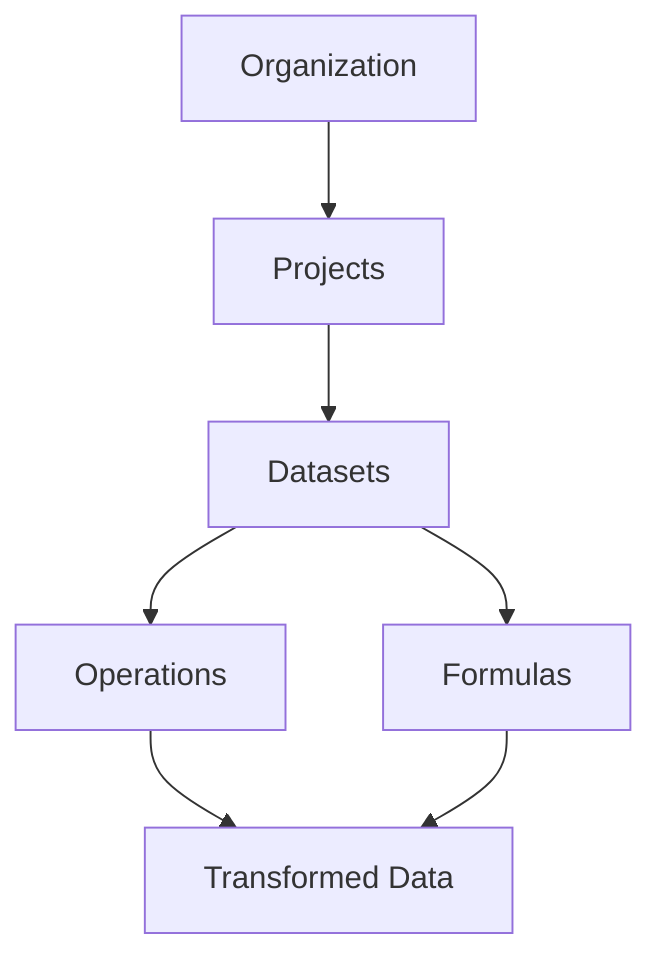
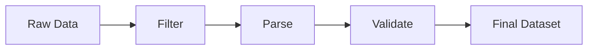

## Overview

Rowbase is built around a few core concepts that work together to help you manage and transform your data.



## Organizations

An **Organization** is the top-level container for all your work in Rowbase. It represents your company or team.

<Info>
Each organization has its own billing, member management, and settings.
</Info>

**Key features:**
- Invite team members with role-based access (Admin, Member, Viewer)
- Configure SSO and security settings
- Manage API keys and integrations

## Projects

A **Project** groups related datasets together. Think of it as a folder for a specific initiative or workflow.

**Examples:**
- "Q1 Marketing Campaign" - contains lead lists, email performance data
- "Customer Data Cleanup" - contains raw and cleaned customer records
- "Sales Pipeline" - contains deal data, forecasts, and metrics

## Datasets

A **Dataset** is a structured collection of data, similar to a spreadsheet or database table.

<Tabs>
  <Tab title="Structure">
    Each dataset has:
    - **Columns** - Named fields with specific data types (text, number, date, boolean)
    - **Rows** - Individual records in your data
    - **Schema** - The structure definition that validates your data
  </Tab>
  <Tab title="Features">
    Datasets support:
    - Automatic type detection on import
    - Version history and rollback
    - Column-level metadata and descriptions
    - Primary key designation for deduplication
  </Tab>
</Tabs>

### Data Types

| Type | Description | Example |
|------|-------------|---------|
| `text` | String values | "Hello World" |
| `number` | Numeric values (integers and decimals) | 42, 3.14 |
| `boolean` | True/false values | true, false |
| `date` | Date and datetime values | 2024-01-15 |
| `json` | Nested JSON objects | `{"key": "value"}` |

## Operations

**Operations** are transformations you apply to datasets. They're non-destructive - the original data is preserved and you can always undo or modify operations.

<AccordionGroup>
  <Accordion title="Filter" icon="filter">
    Remove rows that don't match specified conditions.

    ```
    Filter: status = "active" AND created_at > "2024-01-01"
    ```
  </Accordion>
  <Accordion title="Parse & Transform" icon="wand-magic-sparkles">
    Convert text to numbers, dates, booleans, and more.

    ```
    Parse: "$1,234.56" → 1234.56
    ```
  </Accordion>
  <Accordion title="Use AI" icon="sparkles">
    Generate content, detect headers, and enrich data with AI.

    ```
    Input: product description → Output: category
    ```
  </Accordion>
  <Accordion title="Rename Columns" icon="pen">
    Change column names for clarity.

    ```
    Rename: "col1" → "customer_name"
    ```
  </Accordion>
  <Accordion title="Join & Union" icon="git-merge">
    Combine data from multiple tables.
  </Accordion>
  <Accordion title="Validate" icon="shield-check">
    Ensure data quality with constraints and quarantine rules.
  </Accordion>
</AccordionGroup>

### Operation Pipeline

Operations are applied in sequence, creating a transformation pipeline:



<Tip>
You can reorder, edit, or remove any operation in the pipeline at any time.
</Tip>

## Formulas

**Formulas** let you create computed columns using spreadsheet-like expressions.

### Syntax

Reference other columns using their names:

```
UPPER(first_name) + " " + UPPER(last_name)
```

### Available Functions

<Tabs>
  <Tab title="Text">
    - `UPPER(text)` - Convert to uppercase
    - `LOWER(text)` - Convert to lowercase
    - `TRIM(text)` - Remove whitespace
    - `CONCAT(a, b, ...)` - Join strings
    - `LEFT(text, n)` - First n characters
    - `RIGHT(text, n)` - Last n characters
  </Tab>
  <Tab title="Math">
    - `SUM(a, b, ...)` - Add values
    - `AVG(a, b, ...)` - Average values
    - `MIN(a, b, ...)` - Minimum value
    - `MAX(a, b, ...)` - Maximum value
    - `ROUND(num, decimals)` - Round number
    - `ABS(num)` - Absolute value
  </Tab>
  <Tab title="Logic">
    - `IF(condition, then, else)` - Conditional
    - `AND(a, b, ...)` - All true
    - `OR(a, b, ...)` - Any true
    - `NOT(value)` - Negate
    - `ISBLANK(value)` - Check if empty
  </Tab>
  <Tab title="Date">
    - `NOW()` - Current datetime
    - `TODAY()` - Current date
    - `YEAR(date)` - Extract year
    - `MONTH(date)` - Extract month
    - `DAY(date)` - Extract day
    - `DATEDIFF(a, b, unit)` - Difference between dates
  </Tab>
</Tabs>

## Next Steps

<CardGroup cols="2">
  <Card title="Datasets" icon="table" href="/features/datasets">
    Deep dive into dataset features
  </Card>
  <Card title="Operations" icon="wand-magic-sparkles" href="/features/operations">
    Learn about all available operations
  </Card>
  <Card title="Formulas" icon="function" href="/features/formulas">
    Master formula syntax and functions
  </Card>
  <Card title="API Integration" icon="code" href="/integrations/api">
    Automate with the Rowbase API
  </Card>
</CardGroup>
