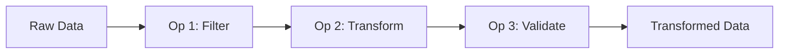

## Overview

Operations are transformations you apply to datasets. They're **non-destructive** - your original data is always preserved, and you can add, remove, or reorder operations at any time.

## Operation Pipeline

Operations are applied in sequence, creating a transformation pipeline:



<Tip>
Click any operation in the pipeline to edit it. Drag to reorder. Changes are applied instantly.
</Tip>

## AI Operations

### Use AI

Generate AI-powered content based on other column data. Perfect for enrichment, classification, and content generation.

```
Input: product description
Output: AI-generated category, summary, or tags
```

### Detect Headers

Use AI to detect column headers in messy data and rename columns automatically.

```
Before: _UNNAMED_0, _UNNAMED_1
After: product_name, price
```

## Transform Operations

### Filter Rows

Keep or exclude rows based on a condition expression.

<Tabs>
  <Tab title="Simple">
    Filter by a single condition:

    | Field | Operator | Value |
    |-------|----------|-------|
    | status | equals | active |
  </Tab>
  <Tab title="Multiple Conditions">
    Combine conditions with AND/OR:

    ```
    status = "active"
    AND created_at > "2024-01-01"
    AND (plan = "pro" OR plan = "enterprise")
    ```
  </Tab>
</Tabs>

**Available operators:**
- Text: equals, not equals, contains, starts with, ends with, is empty, is not empty
- Number: equals, not equals, greater than, less than, between
- Date: equals, before, after, between, is empty
- Boolean: is true, is false

### Select Columns

Keep only specified columns, discarding the rest.

```
Before: name, age, email, phone, address
After: name, email
```

### Rename Columns

Change column names for clarity or consistency.

```
"col1" → "customer_name"
"col2" → "email_address"
```

- Bulk rename multiple columns at once
- Formulas automatically update to use new names

### Drop Column

Remove columns you don't need.

- Remove single or multiple columns
- Removing a column used in formulas will show a warning

### Copy Column

Create a copy of a column with a new name.

```
Before: email
After: email, email_backup
```

### Add Literal Column

Add a new column with a constant value.

```
New column: "status"
Value: "active"
```

### Formula

Compute values using Excel-like formulas with column references.

```
New column: "full_name"
Formula: {{first_name}} + " " + {{last_name}}
```

See [Formulas](/features/formulas) for the complete function reference.

## Text Operations

### Trim Whitespace

Remove leading and trailing whitespace from text values.

```
Before: "  hello  "
After: "hello"
```

### Collapse Whitespace

Replace multiple consecutive spaces with a single space.

```
Before: "hello   world"
After: "hello world"
```

### Normalize Case

Convert text to lowercase, uppercase, or title case.

```
Before: "HELLO"
After: "hello"
```

### Strip Prefix / Suffix

Remove a specified prefix or suffix from text values.

```
Before: "PREFIX_value"
After: "value"
```

### Replace Values

Find and replace text patterns within values.

```
Find: "NY"
Replace: "New York"
Column: state
```

### Snake Case Names

Convert all column names to snake_case format.

```
Before: "Product Name", "First Name"
After: "product_name", "first_name"
```

## Parsing Operations

### Parse Number

Convert text to numeric values, handling various formats.

```
Before: "1,234.56"
After: 1234.56
```

### Parse Boolean

Convert text like 'yes', 'no', 'true', 'false' to boolean values.

```
Before: "yes"
After: true
```

### Parse Timestamp

Parse date/time strings into standardized timestamp format.

```
Before: "01/15/2024"
After: "2024-01-15T00:00:00Z"
```

### Parse Money

Extract numeric amounts from currency strings.

```
Before: "$1,234.56"
After: 1234.56
```

### Parse Percentage

Convert percentage strings to decimal values.

```
Before: "50%"
After: 0.5
```

### Parse Quantity & Unit

Split values like '5 mg' into separate quantity and unit columns.

```
Before: "5 mg"
After: 5, "mg" (two columns)
```

## Null Handling

### Empty to Null

Convert empty strings to null values.

```
Before: ""
After: null
```

### Null to Default

Replace null values with a specified default value.

```
Before: null
After: "(default)"
```

### Coalesce Fields

Use the first non-null value from multiple columns.

```
Columns: nickname, first_name, "Unknown"
Result: first non-null value
```

## Merge Operations

### Union

Combine rows from multiple tables into a single output.

```
Table A: 100 rows
Table B: 50 rows
Result: 150 rows (stacked)
```

### Join

Merge two tables by matching rows on common keys.

```
Left table + Right table
Join on: customer_id
Result: Combined columns where keys match
```

**Join types:**
- Left join (keep all left rows)
- Inner join (only matching rows)
- Full outer join (keep all rows)

### Map Values

Replace values using a lookup table (e.g., codes to names).

```
Lookup: "US" → "United States"
Before: "US"
After: "United States"
```

## Identity Operations

### Generate Unique ID

Create a unique identifier for each row (like a fingerprint for your data).

```
New column: rb_id
Value: rb_abc123...
```

### Apply Corrections

Apply manual data corrections and overrides from the corrections table.

## Validation Operations

### Require Fields

Ensure specified fields are present and not null in every row.

### Unique Constraint

Verify that values in specified columns are unique across all rows.

### Primary Key Constraint

Enforce primary key uniqueness and non-null constraints.

### Validate Schema

Validate data types and structure against a defined schema.

### Quarantine If

Quarantine rows that fail a custom formula-based validation rule.

```
Rule: {{price}} > 0
Result: Rows with zero or negative price are quarantined
```

<Info>
Quarantined rows are moved to a separate table for review, not deleted.
</Info>

## Quality Flags

Flag rows that match specific quality issues:

| Operation | Flags rows where... |
|-----------|---------------------|
| Flag Negative | Numeric field contains negative values |
| Flag Zero | Numeric field contains zero values |
| Flag If Less Than | One column is less than another |
| Flag Invalid Units | Units not in allowed list |
| Flag Missing Units | Quantity has no associated unit |

## Operation History

Every operation is tracked in the history:

- View when each operation was added
- See who made changes (in team workspaces)
- Undo/redo operations
- Reset to any point in history

## Best Practices

<AccordionGroup>
  <Accordion title="Order matters" icon="list-ol">
    Operations apply in sequence. Filter before validation to ensure you only validate relevant records.
  </Accordion>
  <Accordion title="Use descriptive names" icon="tag">
    Name your operations (e.g., "Remove inactive users") so teammates understand the pipeline.
  </Accordion>
  <Accordion title="Preview before applying" icon="eye">
    Always check the preview to verify the operation does what you expect.
  </Accordion>
  <Accordion title="Use AI for complex tasks" icon="sparkles">
    When pattern-based operations aren't enough, use AI operations to handle nuanced transformations.
  </Accordion>
</AccordionGroup>
