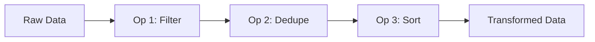

## Overview

Operations are transformations you apply to datasets. They're **non-destructive** - your original data is always preserved, and you can add, remove, or reorder operations at any time.

## Operation Pipeline

Operations are applied in sequence, creating a transformation pipeline:



<Tip>
Click any operation in the pipeline to edit it. Drag to reorder. Changes are applied instantly.
</Tip>

## Available Operations

### Filter

Remove rows that don't match specified conditions.

<Tabs>
  <Tab title="Simple">
    Filter by a single condition:

    | Field | Operator | Value |
    |-------|----------|-------|
    | status | equals | active |
  </Tab>
  <Tab title="Multiple Conditions">
    Combine conditions with AND/OR:

    ```
    status = "active"
    AND created_at > "2024-01-01"
    AND (plan = "pro" OR plan = "enterprise")
    ```
  </Tab>
</Tabs>

**Available operators:**
- Text: equals, not equals, contains, starts with, ends with, is empty, is not empty
- Number: equals, not equals, greater than, less than, between
- Date: equals, before, after, between, is empty
- Boolean: is true, is false

### Sort

Order rows by one or more columns.

```
Primary: created_at (Descending)
Secondary: name (Ascending)
```

- Sort by multiple columns for tie-breaking
- Choose ascending or descending for each column
- Null values are sorted to the end by default

### Deduplicate

Remove duplicate rows based on key columns.

**Options:**
- **Key columns** - Which columns to check for duplicates
- **Keep** - First occurrence, last occurrence, or remove all duplicates

<Warning>
Deduplication order depends on the current sort. Apply a sort operation first if you need to control which duplicate is kept.
</Warning>

### Rename Column

Change column names for clarity or consistency.

```
"col1" → "customer_name"
"col2" → "email_address"
```

- Bulk rename multiple columns at once
- Formulas automatically update to use new names

### Add Column

Add a new column to your dataset.

**Column types:**
- **Empty column** - Add a column with null values
- **Constant value** - Fill with a static value
- **Formula** - Compute values from other columns

```
New column: "full_name"
Formula: first_name + " " + last_name
```

### Remove Column

Delete columns you don't need.

- Remove single or multiple columns
- Removing a column used in formulas will show a warning

### Change Type

Convert a column to a different data type.

| From | To | Example |
|------|----|---------|
| text | number | "42" → 42 |
| text | date | "2024-01-15" → Date |
| number | text | 42 → "42" |
| text | boolean | "true" → true |

<Info>
Values that can't be converted become `null`. Review the preview before confirming.
</Info>

### Fill Empty

Replace null or empty values in a column.

**Fill options:**
- **Constant** - Replace with a static value
- **Previous value** - Fill with the value from the row above
- **Next value** - Fill with the value from the row below

### Split Column

Split a text column into multiple columns based on a delimiter.

```
"John,Doe,john@example.com"
→ ["John", "Doe", "john@example.com"]
```

**Options:**
- Delimiter (comma, tab, pipe, custom)
- Maximum splits
- New column names

### Merge Columns

Combine multiple columns into one.

```
first_name + " " + last_name → "John Doe"
```

- Choose a separator (space, comma, none)
- Include or exclude null values

### Find & Replace

Replace values in a column.

**Modes:**
- **Exact match** - Replace exact values only
- **Contains** - Replace partial matches
- **Regex** - Use regular expressions for complex patterns

```
Find: "NY"
Replace: "New York"
Column: state
```

### Trim Whitespace

Remove leading and trailing whitespace from text columns.

- Apply to one or all text columns
- Optionally normalize internal whitespace (multiple spaces → single space)

## Bulk Operations

Apply operations to multiple columns at once:

1. Select columns using checkboxes
2. Right-click or use the bulk actions menu
3. Choose an operation
4. Configure and apply

## Operation History

Every operation is tracked in the history:

- View when each operation was added
- See who made changes (in team workspaces)
- Undo/redo operations
- Reset to any point in history

## Best Practices

<AccordionGroup>
  <Accordion title="Order matters" icon="list-ol">
    Operations apply in sequence. Filter before deduplication to ensure you keep the right records.
  </Accordion>
  <Accordion title="Use descriptive names" icon="tag">
    Name your operations (e.g., "Remove inactive users") so teammates understand the pipeline.
  </Accordion>
  <Accordion title="Preview before applying" icon="eye">
    Always check the preview to verify the operation does what you expect.
  </Accordion>
  <Accordion title="Start broad, then narrow" icon="filter">
    Apply general transformations first (type changes, renames), then specific filters.
  </Accordion>
</AccordionGroup>
